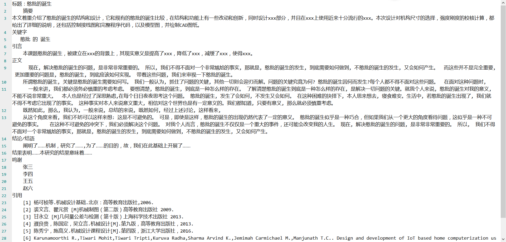

# The generator of random papers

#### Description
As the name implies, make up a paper generator

According to the title and type, make up a paper

Only for GUI display test, purely funny, do not use it for other purposes

If there are bad results, we are not responsible

#### Software Architecture
None

#### Installation

1.  None

#### Instructions

1.  None

#### Contribution

1.  Fork the repository
2.  Create Dev_ branch
3.  Commit your code
4.  Create Pull Request

#### Source of inspiration

[BullshitGenerator](https://github.com/menzi11/BullshitGenerator)

#### Effect preview

