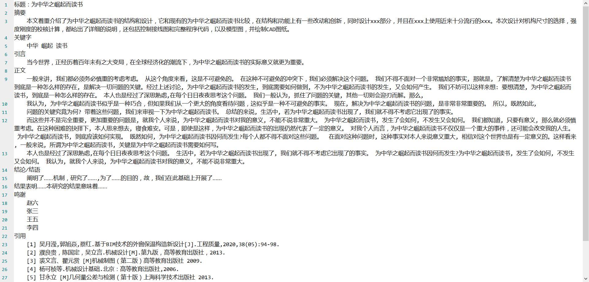

# 胡编乱造论文生成器

#### 介绍
顾名思义，胡编乱造论文生成器

根据题目和类型，胡编乱造一篇论文

仅用于GUI显示测试，纯属搞笑，勿作他用

如有恶果，概不负责

#### 软件架构
无

#### 安装教程

1.  无

#### 使用说明

1.  无

#### 参与贡献

1.  Fork 本仓库
2.  新建 Dev_ 分支
3.  提交代码
4.  新建 Pull Request

#### 灵感来源

[狗屁不通文章生成器](https://github.com/menzi11/BullshitGenerator)

#### 效果预览

